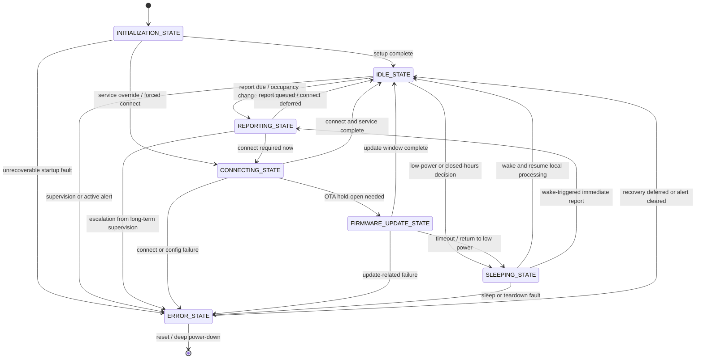
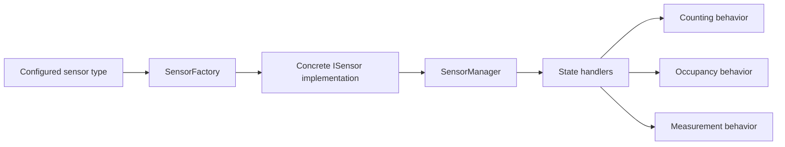
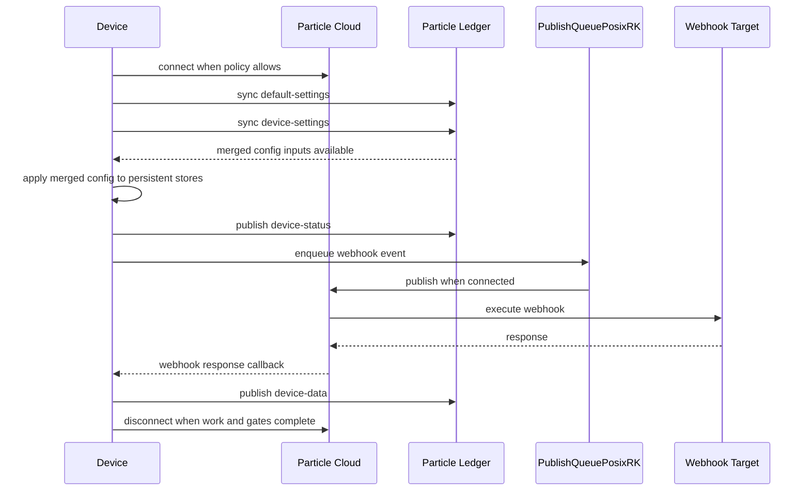
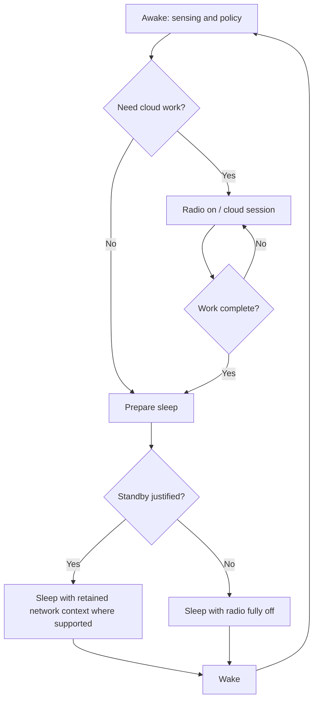
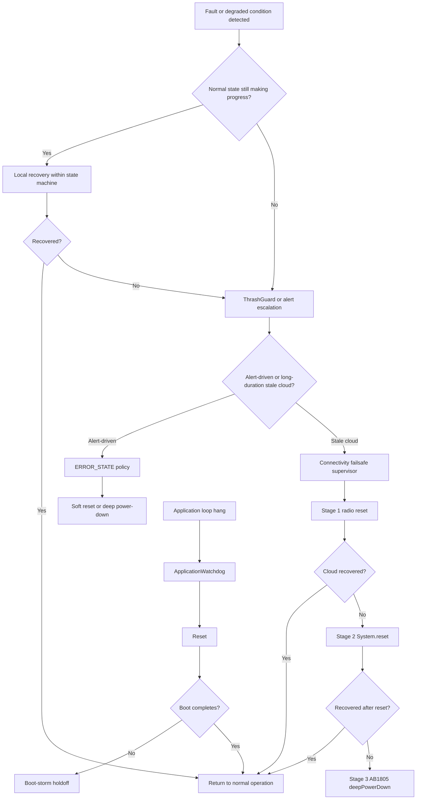

# Generalized-Core-Counter Architecture Overview

## 1. Purpose and Design Goals

Generalized-Core-Counter is a reusable firmware platform for low-power Particle-based sensor devices that spend most of their life unattended. The platform is designed to support multiple sensing patterns, multiple radio types, and long-lived deployments without coupling the application to any single sensor or product configuration.

The firmware is intended to support:

- generic reusable firmware behavior across products
- multiple sensor support behind a stable abstraction
- counting and occupancy use cases, with measurement mode available for broader sensor classes
- cellular and Wi-Fi deployments
- long-duration unattended operation
- remote configuration through the Particle cloud
- battery and solar-backed operation
- operational resiliency in poor connectivity or unstable power conditions

The major design principles are:

- State-machine driven: lifecycle work is expressed as explicit states so power, timing, and recovery decisions remain visible and testable.
- Non-blocking operation: no single wake-cycle phase should monopolize control indefinitely; long operations are budgeted and revisited across loop iterations.
- Cloud-optional operation: sensing and local state tracking continue even when cloud access is unavailable or intentionally disabled.
- Battery-aware behavior: connection frequency, standby behavior, and recovery aggressiveness are shaped by available energy.
- Recovery before reset: the system first contains and repairs faults in-place, then escalates only when lower-cost actions fail.
- Persistent operational state: the device preserves enough state across sleep and reset to resume policy decisions, explain prior failures, and avoid repeating the same action blindly.

These goals favor predictable behavior over maximizing instantaneous throughput. The platform is optimized for devices that wake, sense, decide, optionally connect, publish, and return to a safe low-power posture.

---

## 2. High-Level System Architecture

The firmware is organized around a central state machine that coordinates sensing, connectivity, reporting, recovery, and sleep. Sensors and cloud integrations do not drive the application directly; they provide services to the state machine.

```text
          +-------------------+
          |      Sensors      |
          +-------------------+
                    |
                    v
          +-------------------+
          |   SensorManager   |
          +-------------------+
                    |
                    v
          +-------------------+
          |   State Machine   |
          +-------------------+
             |    |     |    |
             |    |     |    +-------------------+
             |    |     +--------------------+   |
             |    +---------------------+    |   |
             v                          v    v   v
   +----------------------+  +----------------------+  +----------------------+
   | Reporting            |  | Connectivity         |  | Recovery             |
   | - periodic reports   |  | - radio lifecycle    |  | - watchdogs          |
   | - ledger egress      |  | - cloud sessions     |  | - thrash protection  |
   | - webhook queue      |  | - connect budgets    |  | - staged escalation  |
   +----------------------+  +----------------------+  +----------------------+
                    \                 |                 /
                     \                |                /
                      \               v               /
                       +-----------------------------+
                       |      Power Management       |
                       |  battery tiers, sleep, RTC  |
                       +-----------------------------+
                                      |
                                      v
                             +----------------+
                             | Particle Cloud |
                             +----------------+
                                      |
                                      v
                             +----------------+
                             | Ledger +       |
                             | Webhooks       |
                             +----------------+
```

Architecturally, the important relationships are:

- SensorManager normalizes hardware-specific sensing into a common application interface.
- The state machine decides when sensing, reporting, connection, or sleep work is allowed to proceed.
- Power management constrains all other subsystems by determining when the device can afford to connect, stay awake, or preserve standby behavior.
- Recovery logic supervises the state machine and connectivity stack from above rather than replacing their normal responsibilities.
- Cloud integration is authoritative for configuration, but not required for local sensing continuity.

---

## 3. State Machine Architecture

The state machine is the top-level control structure for the firmware. It exists to make wake-cycle behavior explicit, bounded, and observable. Without it, sensing, cloud, and sleep logic would interleave implicitly and become difficult to reason about under battery and connectivity stress.

Most behavior is intentionally delegated to state handlers instead of living in `loop()` directly. This keeps the main loop small and makes each phase responsible for a single decision space: initialization, sensing, reporting, connecting, sleeping, updates, or fault handling.

### State Responsibilities

| State | Purpose | Typical Entry Conditions | Typical Exit Conditions |
| --- | --- | --- | --- |
| `INITIALIZATION_STATE` | Bring up persistent stores, hardware services, watchdogs, subscriptions, and baseline policy. | Cold boot, reset, wake from hard restart. | Setup complete, service-button override, or early fault detection. |
| `IDLE_STATE` | Perform awake-time decision making while sensors remain active. Evaluate report timing, occupancy transitions, and whether the device should stay awake or sleep. | Post-setup steady state, post-connect steady state, or return from reporting without immediate connect. | Scheduled report due, occupancy/service trigger, overnight sleep decision, or error escalation. |
| `REPORTING_STATE` | Capture current readings, update local counters, queue telemetry, and decide whether cloud connection is needed now or can be deferred. | Scheduled interval reached, occupancy transition, service request, or other report trigger. | `CONNECTING_STATE` for immediate cloud work, or `IDLE_STATE` if deferred/offline. |
| `CONNECTING_STATE` | Own the radio lifecycle and bounded connection attempt. Load cloud config, publish ledger updates, and transition to update or idle behavior. | Reporting requires cloud access, forced recovery connect, or operator override. | Successful cloud work, timeout, failure alert, or transition to `FIRMWARE_UPDATE_STATE`. |
| `SLEEPING_STATE` | Drain/close cloud work, power down radios as needed, configure wake sources, and enter low-power sleep. | Idle policy determines the device should stop active work and sleep. | Wake from timer, service button, PIR interrupt, or sleep-related error. |
| `ERROR_STATE` | Contain faults and choose a conservative recovery action based on alert class and recent reset history. | Explicit alert escalation from another state, or supervision logic decides recovery is required. | Return to `IDLE_STATE`, `System.reset()`, or AB1805 deep power-down. |
| `FIRMWARE_UPDATE_STATE` | Hold the cloud session open long enough for OTA-related work without allowing update checks to dominate the normal sleep cadence indefinitely. | Connected state detects pending updates or update-related hold-open work. | Updates complete, timeout, operator cancel path, or return to `IDLE_STATE`/`SLEEPING_STATE`. |

### State Transition Diagram



The state machine is intentionally conservative about ownership. For example, `CONNECTING_STATE` owns connection attempts, and the long-duration connectivity failsafe is required to defer while that ownership is active. That separation prevents recovery logic from fighting normal connection logic.

---

## 4. Sensor Architecture

The sensor layer isolates hardware-specific measurement behavior from application policy.

The primary roles are:

- `ISensor`: stable abstraction for setup, loop, data retrieval, wake/sleep hooks, and health reporting
- `SensorFactory`: maps configured sensor types to concrete sensor implementations while preserving stable type identifiers
- `SensorManager`: owns the active sensor instance and exposes a single sensing interface to the rest of the firmware

This design allows the application to reason about sensor readiness and sensor data without depending on PIR-specific or future sensor-specific implementation details.

### Architectural Intent

- Hardware abstraction: state handlers interact with a logical sensor service rather than with raw pins or protocol drivers.
- Platform independence: sensor code is decoupled from radio policy and cloud behavior, which makes it easier to move between Boron, Photon 2, and Argon.
- Sensor growth path: new sensor types are introduced by implementing `ISensor` and registering them with the factory, without changing the state-machine contract.
- Mode specialization: counting and occupancy use the same underlying sensing service, but the state machine interprets the results differently.

Counting mode treats sensor events as discrete increments. Occupancy mode treats sensor events as state transitions with debounce, occupied duration accumulation, and optional immediate reporting on transitions.

### Sensor Interaction Diagram



The important boundary is that SensorManager decides how to speak to the sensor, while the state machine decides what the sensor reading means operationally.

---

## 5. Persistent Data Architecture

The firmware uses three distinct categories of state, each with a different durability purpose.

### Persistent Stores

| Store | Ownership | Typical Contents | Architectural Role |
| --- | --- | --- | --- |
| `sysStatus` | System configuration and long-lived operational policy | time zone, open/close hours, connection mode, reporting interval, connect budgets, current battery tier, connectivity failsafe stage | Authoritative persisted operating policy and long-lived recovery context |
| `sensorConfig` | Sensor-specific configuration | sensor tuning, debounce windows, thresholds, sampling parameters | Durable configuration for the active sensor model |
| `current` | Runtime domain data that must survive sleep/reset | counters, occupancy state, last alert, state-of-charge snapshot, accumulated occupancy totals | Device's current operational picture and field-visible health |

### Persistence Model

- FRAM-backed persistence: the main durable stores are written through the persistence layer so configuration and operational state survive resets and long deployments.
- Retained variables: small reset-surviving values hold cross-reset breadcrumbs, boot-storm counters, and thrash diagnostics that are useful for explaining what happened during the last boot.
- Runtime state: session flags coordinate a single wake cycle and must not be persisted because they describe in-flight ownership, pending webhook windows, or temporary suppression logic.

These layers intentionally solve different problems:

- FRAM-backed stores preserve what the device should know after an arbitrary restart.
- Retained variables preserve what happened immediately before the restart.
- Runtime state preserves only what matters while the current wake cycle is still alive.

### Cloud Synchronization Model

Cloud configuration is authoritative, but it is not applied continuously from the network. Instead, the device synchronizes cloud ledgers during a successful connection window, merges defaults and overrides, applies the result to persistent storage, and then operates locally from persisted values until the next successful sync.

That decision is important for unattended operation:

- local sensing does not depend on a live cloud session
- devices can continue sleeping and reporting with the last known good config
- recovery and power decisions remain available across resets

---

## 6. Cloud Architecture

The cloud subsystem separates configuration ingress from telemetry egress.

### Roles

- Particle Cloud provides connection, publish, subscribe, OTA, and ledger transport.
- Particle Ledger is the authoritative configuration and status synchronization mechanism.
- PublishQueuePosixRK provides a durable queue for outbound event publishes so data is not lost when the device is offline.
- Webhook publishing provides the legacy external integration path for sensor payload delivery.

### Ledger Responsibilities

| Ledger | Direction | Scope | Architectural Responsibility |
| --- | --- | --- | --- |
| `default-settings` | Cloud to device | Product | Product-wide baseline configuration |
| `device-settings` | Cloud to device | Device | Per-device overrides |
| `device-status` | Device to cloud | Device | Effective running configuration and health/status summary |
| `device-data` | Device to cloud | Device | Latest structured sensor/telemetry snapshot |

### Configuration Merge Behavior

The device treats product defaults and device overrides as a two-level hierarchy:

1. Read product defaults from `default-settings`.
2. Read per-device overrides from `device-settings`.
3. Merge by section, with device values taking precedence.
4. Apply the merged result to persistent stores.
5. Publish `device-status` so operators can see the configuration actually in force.

This architecture is deliberately cloud-authoritative but locally cached. It allows the cloud to remain the source of truth while still permitting long offline intervals.

### Telemetry Flow

Telemetry uses two parallel paths:

- webhook/event publishing for external integrations
- ledger egress for structured device visibility in Particle Console

The queue-backed webhook path ensures outbound telemetry survives offline periods. The ledger path ensures the cloud can inspect the latest structured status once synchronization resumes.

### Sequence Diagram



The sleep gate intentionally waits for queue drain, ledger synchronization, OTA checks, and webhook supervision before allowing radio teardown.

---

## 7. Connectivity Architecture

Connectivity is treated as a constrained resource, not as a permanently available baseline.

### Connection Modes

| Mode | Intent | Architectural Effect |
| --- | --- | --- |
| `CONNECTED` | Stay connected during operating hours | favors low-latency cloud access over battery savings |
| `INTERMITTENT` | Connect only when scheduled or required | default low-power mode for periodic reporting |
| `INTERMITTENT_KEEP_ALIVE` | Preserve faster reconnect behavior when justified | useful for occupancy workflows where state changes matter during open hours |
| `DISCONNECTED` | Operate cloud-optional/offline | suppresses automatic connection attempts and long-duration connectivity recovery |

### Radio Lifecycle

The radio lifecycle is explicit:

1. Sleep or idle while the radio is off whenever policy allows.
2. Enter `CONNECTING_STATE` only when a report, override, update, or recovery path requires it.
3. Apply a bounded connection budget.
4. Perform configuration sync and required cloud work.
5. Tear down cloud and radio state with separate bounded budgets.
6. Return to `IDLE_STATE` or `SLEEPING_STATE` depending on the operating mode.

### Connect Budgets and Deep Attempts

The firmware uses two connection budgets:

- a normal budget for the common case
- a deeper periodic budget that allows slower modem recovery behavior to complete

The deeper budget is intentionally not used every cycle. It is permitted periodically or when battery state is healthy enough to spend extra energy on recovery. This limits battery waste while still preserving a path for difficult cellular recoveries.

### Disconnect Behavior

Disconnect is treated separately from connect because failure modes differ:

- cloud disconnect has its own budget
- radio power-down has its own budget
- standby behavior is allowed only where it is justified by platform and battery context

### Connectivity Philosophy

- connect only when necessary
- minimize radio-on time
- preserve battery and solar energy budget
- avoid indefinite waits at every phase of the connection lifecycle

This philosophy is the foundation for both the normal connection flow and the higher-level recovery ladder.

---

## 8. Power Management Architecture

Power management is a policy subsystem, not just a collection of battery reads.

### Battery Tiers

| Tier | Intent | Typical Behavioral Effect |
| --- | --- | --- |
| `HEALTHY` | Normal energy availability | standard reporting/connect cadence |
| `CONSERVING` | Moderate energy pressure | reduced connectivity aggressiveness, less willingness to preserve standby |
| `CRITICAL` | Strong energy pressure | more aggressive back-off and reduced optional work |
| `SURVIVAL` | Protect minimum device life | minimal connectivity and suppression of higher-cost recovery actions unless externally powered |

Tier transitions use hysteresis so the firmware does not oscillate between policies when state of charge hovers near a threshold.

### Architectural Responsibilities

- normalize platform-specific battery and power-source telemetry
- derive a power tier and policy recommendations
- shape reporting/connect cadence based on energy availability
- apply PMIC/input-power profiles when the platform supports them
- suppress expensive recovery actions when battery state makes them unsafe

Detailed input-power profile behavior is documented in
[`docs/architecture/power-management.md`](architecture/power-management.md).
The June 2026 Boron PMIC charging root cause is preserved in
[`docs/postmortems/2026-06-pmic-charging-root-cause.md`](postmortems/2026-06-pmic-charging-root-cause.md).

### Deployment Scenarios

- Solar deployments: prioritize bounded connection time, back-off behavior, and survival during poor charging conditions.
- USB-powered or externally powered deployments: allow more aggressive recovery and faster interactive behavior because energy scarcity is lower.

### Sleep and Wake Model

The device primarily uses low-power sleep to end the wake cycle. Wake sources include:

- timer-based wake for scheduled reporting or open-hours resumption
- service button wake for operator intervention
- sensor interrupt wake for event-driven sensing, especially occupancy behavior
- watchdog or recovery-triggered restart paths when normal flow fails

The AB1805 RTC provides reliable long-duration timing and also participates in the hardware watchdog and deep power-down path.

### Power-State Diagram



The key architectural rule is that sleep is not a side effect. It is an explicit state transition informed by sensing, cloud work, and power policy.

---

## 9. Recovery and Resiliency Architecture

Recovery is a first-class subsystem because unattended devices fail in ways that are gradual, intermittent, and often power-sensitive.

### Recovery Philosophy

The system follows a staged escalation model:

1. Detect
2. Recover
3. Escalate
4. Reset only when necessary

The goal is to preserve useful work and battery life before falling back to disruptive actions.

### Recovery Components

#### ApplicationWatchdog

The software watchdog detects when the main application loop stops making progress for too long. Its role is to catch hangs that violate the intended non-blocking architecture.

#### AB1805 Hardware Watchdog

The AB1805 hardware watchdog is the lower-level backstop. It exists in case the software watchdog or application logic can no longer service itself. This provides recovery even when the CPU remains alive but the firmware is no longer behaving coherently.

#### ThrashGuard

ThrashGuard supervises top-level state progress. It is not a duplicate of the watchdogs; instead, it looks for repeated no-progress behavior inside the normal state machine and responds in graduated steps before full reset.

#### Boot-Storm Protection

Boot-storm logic handles the case where the device repeatedly resets before setup completes and therefore never reaches normal error supervision. It uses retained counters and a holdoff sleep to prevent infinite early-reset loops.

#### `ERROR_STATE` Supervision

`ERROR_STATE` is the centralized policy point for alert-driven containment. It decides whether to do nothing, perform a soft reset, or escalate to AB1805 deep power-down based on alert class and recent reset history.

#### Connectivity Failsafe Supervisor

The connectivity failsafe handles a different failure class: the device remains operational but has not successfully reached the Particle cloud for an unusually long time. It persists escalation state so recovery can continue across resets instead of restarting from the lowest rung every time.

### Escalation Ladder

| Layer | Trigger Class | First Response | Escalation |
| --- | --- | --- | --- |
| Local state supervision | no-progress inside a wake cycle | ThrashGuard backoff or forced sleep/disconnect | soft reset if repeated |
| Alert-driven error recovery | explicit operational alert | `ERROR_STATE` policy decision | deep power-down for repeated severe cases |
| Long-duration connectivity recovery | cloud stale for many hours | stage 1 radio reset | stage 2 `System.reset()`, stage 3 AB1805 deep power-down |
| Early-boot instability | repeated reset before setup completes | boot-storm holdoff sleep | operator-visible boot-storm alert |
| Full application hang | loop stops progressing | ApplicationWatchdog | AB1805 hardware watchdog if needed |

### Recovery Flow Diagram



### Retained Breadcrumbs

Retained breadcrumbs record where the firmware was in the lifecycle immediately before a reset or deep recovery event. They are used for attribution, not for normal control flow.

Their architectural purpose is to answer questions such as:

- did the previous boot fail during setup, reporting, connect, or sleep?
- was a watchdog or connectivity failsafe involved?
- did the device reset before it could publish its own explanation?

### Persisted Recovery State

The connectivity failsafe persists its stage, last action time, and action count in `sysStatus`. That persistence matters because the system is designed to survive across:

- sleep cycles
- soft resets
- staged recovery attempts separated by long cooldown windows

### Why Recovery Actions Are Staged

Staging avoids two common failure patterns in remote devices:

- burning large amounts of power on aggressive resets that were not needed
- repeating the same low-cost action forever with no memory of prior failure

Radio reset is cheaper than full reset. Full reset is cheaper than hard power removal. Persisted staging lets the firmware move upward only when evidence says lower-cost recovery was not enough.

---

## 10. Time and Scheduling Architecture

Time is treated as an operational dependency because open-hours behavior, report cadence, and overnight sleep decisions all depend on trustworthy local time.

### Components

- AB1805 RTC: durable time base and deep-sleep coordination
- Particle time synchronization: cloud-assisted correction when connected
- LocalTimeRK: conversion from UTC to configured local time zone
- LocalTimeCache: cached local-time snapshot so repeated scheduling decisions do not repeatedly pay the full conversion cost

### Architectural Responsibilities

- determine whether system time is valid enough for open/close-hours policy
- convert UTC to the configured local timezone without spreading timezone logic across states
- align sleep duration and report timing to operating windows
- handle overnight behavior without forcing unnecessary awake time during closed hours

The firmware intentionally distinguishes between time validity and cloud connectivity. A device may continue operating locally from valid time even when the cloud is temporarily unavailable.

Open/close-hours logic controls whether the device should remain awake, defer reports, preserve occupancy responsiveness, or take long closed-hours sleep. Overnight behavior is therefore a scheduling policy, not just a sleep duration.

---

## 11. Observability and Diagnostics

The firmware is designed to explain itself in the field.

Key observability outputs include:

- startup status payloads with version, reset reason, active alert, breadcrumb, and failsafe state
- diagnostic publishes routed through the queue when safe to do so
- compact wake-cycle logs showing connection, service, and teardown timing
- alert codes for operational fault classes
- retained breadcrumbs and reset-reason reporting for post-reset attribution

Operators diagnose field issues by correlating:

- startup status events
- queue and webhook behavior
- alert history
- battery tier and power-source behavior
- recovery-stage progression
- reset reasons and previous lifecycle breadcrumbs

This architecture is intentionally redundant: the device tries to provide both a durable cloud-visible summary and enough local log context to understand why a reset or escalation occurred.

---

## 12. Supported Platforms

Current supported platforms are:

- Boron
- Photon 2
- Argon

Architecturally, the platform differences are handled behind radio and power abstractions.

| Platform | Radio Model | Architectural Differences |
| --- | --- | --- |
| Boron | Cellular | modem lifecycle, standby behavior, PMIC/fuel-gauge interactions, and long-duration connectivity recovery are most critical here |
| Photon 2 | Wi-Fi | Wi-Fi-specific radio teardown and no cellular standby semantics |
| Argon | Wi-Fi | Gen3 Wi-Fi path with different platform capabilities but the same high-level state-machine contract |

The important invariant is that application behavior is expressed in platform-neutral policy terms. Platform-specific APIs are confined to the abstraction layers that know how to implement those policies safely.

---

## 13. Repository Layout

The repository is organized by responsibility:

- `src/`: top-level application lifecycle, persistent state, project policy, and subsystem entry points
- `src/state/`: state-machine handlers and shared cross-state interfaces
- `src/sensors/`: sensor abstraction and concrete sensor implementations
- `src/cloud/`: ledger clients, configuration application, device-status/data publishing, and webhook integration support
- `src/power/`: connectivity policy, platform power abstraction, and power classification/telemetry
- `src/time/`: cached local-time helpers and scheduling support
- `src/observability/`: wake-cycle and operational diagnostics support
- `docs/`: release, operational, recovery, soak, and architecture documentation
- `lib/`: vendored libraries used for RTC, queueing, storage, time conversion, and ledger support

This layout mirrors architectural domains rather than forcing every feature through a single application file.

---

## 14. Architectural Constraints

The following rules are structural, not stylistic:

- `loop()` must remain non-blocking at the application level.
- watchdogs must remain serviced by normal control flow rather than by ad hoc exception paths.
- state transitions must remain explicit so ownership and recovery boundaries stay visible.
- connectivity budgets must be respected; no new unbounded waits should appear in connect, service, disconnect, or sleep gates.
- cloud configuration must remain authoritative even though the device operates from persisted local copies between syncs.
- persistent data schemas must be versioned and evolved carefully so deployed devices do not lose durable state.
- recovery should prefer staged escalation rather than immediate reset.

Violating these constraints would make the system harder to reason about under exactly the field conditions it is designed to survive.

---

## 15. Future Refactoring Roadmap

The following extractions are planned after soak:

- `ConnectivityFailsafe`: isolate long-duration stale-cloud detection and staged recovery policy.
- `AppBootstrap`: extract setup-time orchestration, boot-storm handling, and startup diagnostics from the main application entry.
- `OpenHoursPolicy`: separate time-window eligibility and overnight behavior from state handlers.
- `CloudServices`: consolidate ledger ingress, status egress, webhook supervision, and queue-aware cloud gate logic.
- `AppDiagnostics`: gather startup status, breadcrumb reporting, alert summaries, and wake-cycle observability in one architectural surface.

These are organizational improvements only and should not alter behavior.
